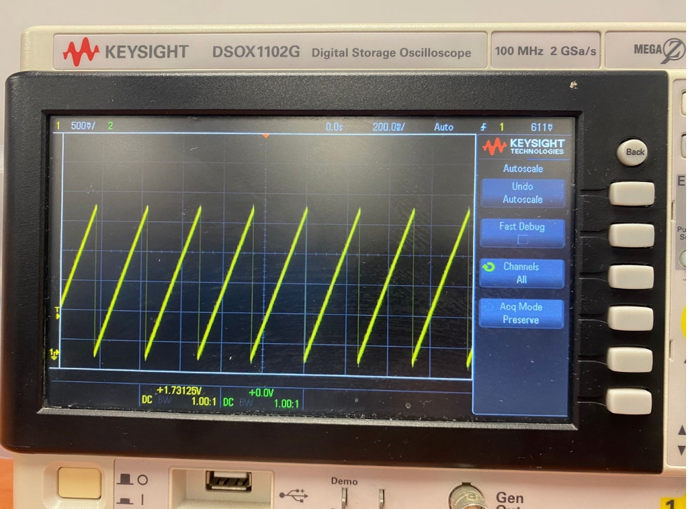
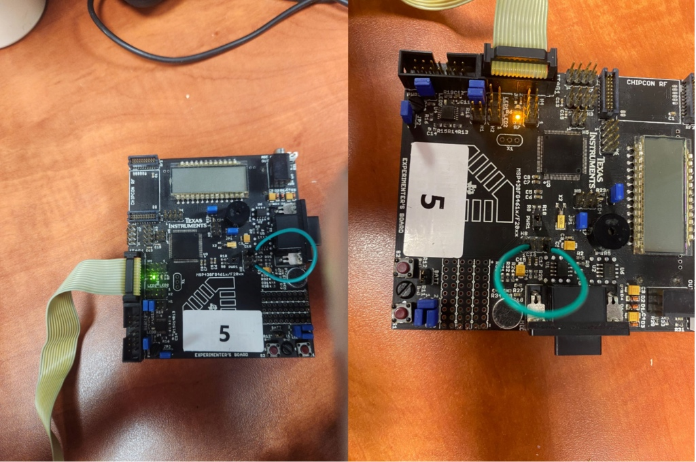

# MSP430 Sawtooth Wave Generator & ADC LED Monitor

This project demonstrates a closed-loop system on the MSP430 microcontroller. It generates an analog sawtooth wave, reads it back into the system, and provides visual feedback using the onboard LEDs based on the voltage level.

## How It Works
1. **DAC (Digital-to-Analog Converter):** Generates a continuous sawtooth wave. While theoretically programmed for a 2.5V peak, hardware characteristics cause the actual output to reach a peak of **~1.73V** with a period of ~256ms. The output is routed to pin `P6.6`.
2. **ADC (Analog-to-Digital Converter):** Reads the voltage levels generated by the DAC via a jumper wire.
3. **LED Indicators:** The code configures the LEDs to act as a simple voltmeter that displays the voltage level of the sawtooth wave. Because the wave rises linearly, the LEDs light up sequentially depending on the measured voltage:
   * **< 0.625V:** All LEDs are off.
   * **0.625V to 1.25V:** The first LED (Green) turns on.
   * **1.25V to 1.73V (Peak):** The Green LED turns off, and the second LED (Orange) turns on.
   * *(Note: The code contains a threshold for a third LED at >1.875V. However, because the physical peak voltage of the system maxes out at 1.73V, this threshold is never reached, and only two LEDs toggle in practice.)*

## Oscilloscope Verification
To verify the DAC output, the generated signal was measured using an oscilloscope:
* **Amplitude:** The peak voltage reaches ~1.73V (as automatically measured and verified across ~3.5 divisions on the 500mV/div scale).
* **Period:** The wave completes a full cycle in approximately 256ms (on the 200ms/div scale).

## Hardware Setup
* **Jumper Wire:** Connect a jumper wire between **P6.6** (DAC Output) and **P6.0** (ADC Input) to close the loop.
* **Microcontroller:** MSP430 series (configured for the MSP430F461x/F20xx Experimenter's Board).

## Power Efficiency
The main loop utilizes Low Power Mode 0 (`LPM0`). The processor sleeps between timer interrupts and only wakes up to process the ADC conversion and update the LEDs, saving power.
